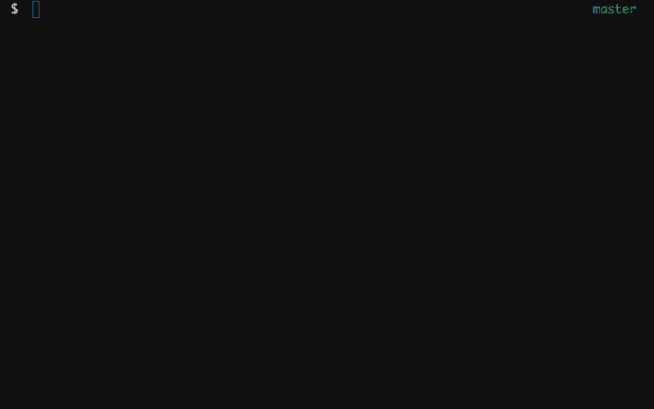

# Adventure



**'Adventure'** is a (currently) Terminal-Based text-based adventure game, where you, the player, awake suddenly inside a strange and mysterious world of monsters and ruffians and other horrible things! You will need to carefully inspect and size up potential foes before engaging them, as you'll need stronger and stronger weapons and armour to progress through the world! Maybe there's a way out? Who knows...

This game was created by me, (Drew, @oheydrew!) as an experiment as a very newbie coder merely a month into their coder academy bootcamp. This whole project was concieved as a way for me to get my hands dirty with writing actual, practical code- as a way of incorporating the exercises I've been doing in my bootcamp course into part of an actual, working codebase. 

It stands as an exercise in Object Oriented Programming, and I've been trying to learn from guides such as [Sandi Metz](http://www.sandimetz.com) wonderful [Practical Object Oriented Programming in Ruby](http://www.poodr.com) to get me on the right path. It's very much a WIP, and it may never be fully realised, but it's all a bit of fun.

## Key ideas

- Randomly generated maps (and possibly enemies?)

- Inventory/Weapons system, intending to use D&D style dice rolls for combat

- Class based, OO-style design, attempting to stick to the Single Class Responsibility and Avoid Multiple Dependencies principles where possible

## Installation

You'll need [**Ruby 2.4.1**](https://www.ruby-lang.org/en/) and [**Bundler**](http://bundler.io/) to get started. You can download them on mac using [Homebrew](https://brew.sh/).

Once you've got that going, clone this repo using Git, or download and extract the .zip file.

Head to the root directory, and execute

```shell
bundle install
```

cd into the '/lib/' directory, and run

```shell
ruby adventure.rb
```

And you're on your adventure!

## Development Diary

### **V0.1: First Build, Initial Concepts / Classes**

Given my [intitial reasons](#adventure) for doing the project, I started out thinking about classes. That's where this idea came from, the thousands who have used it as an extended exercise before me. So, off I went defining classes:

- 'World' class contains locations, and generates the random world
- 'Location' class contains items and enemies, and has entry points
- 'Entity' class will be player or enemies, and will reside in locations?
- 'Item' class will be items, maybe even weapons, too?

#### 2D Array World
My first "go at" the code was just to wade in with these ideas. I successfully made locations, then some hashes of random data to spit to them to generate random names and descriptions for them. This worked fine, with a few sets of data. I then read up on "2d Arrays" as a way to store them in an X, Y coordinate fashion.

#### Problems
It became pretty clear early on that I didn't know what I was doing re: what belonged in what class, and what was being sent where. I had to wrap the world into almost every function entity called, and I was trying to move objects with the world class, and everything got really messy. That's when someone told me to read Sandi Metz book.

It was a hell of an eye opener- even the first 4 or so chapters got me going in a way I couldn't before. I'm no expert, but I then had an idea of where to restructure.

### **V0.3: Second Build / Refactor**
POODR is a great book, and it taught me a few things about class responsibility, heirachy, single responsibilities, and about the concept of 'messages' being sent between classes. It also talked about dependency management, and that was a huge issue I was having.

I thought about what I wanted to do, and realised a few things. 
- 'World' isn't a class itself, just an array of 'Locations'.
- Instead of a 'World' class, I thought about an 'Engine' class, that could be initiated as a 'game', which held a lot of game logic and game state stuff. 
- Taking this further, I considered an 'interface' class, to handle input and output functions / menu systems.
- I wanted 'Entity' to extend to have 2 types, 'Player' and 'Enemy', but they would have mostly the same attributes and logic, that way it could be changed later (ie, multiple players, etc... not that I plan to, but it's the *principle*, dangit)

With this, I have new classes:

- Engine: Stores world(array of locations), and player. Responsible for game state, and logic 
- Interface: Stores nothing, merely a utility class for input and output
- Location: Initializes itself with name and description from a data list, stores items and enemies
- Entity: A player, or creature in the world. It can hold items, equip a weapon and has health. It is responsible for actions on itself such as move, attack, defend, get, etc.
- (Entity)Player: Possible subclass of entity, designed to be controlled by the player
- (Entity)Enemy: Possible subclass of entity, designed to be controlled by computer. possible basic AI functions if required?

I haven't thought fully out how the interactions between player, location and entity will play out, and what controls which. It's possible I won't 'store' enemies in location, rather, devise a way of checking when their coordinates match up with the players. I intend to experiment a little with this.

At this point, I can move around the world, and not fall off the edge of it to my doom. I can look around, and it'll print the name of the location and it's description. I also added an admin "system_msg" interface function to tell me stuff, which I plan to be able to enable or disable.

I also have a considerable amount of the menu function in place. It splits the user's input into relevant Command, Target attributes (ie "Move" "North"), ignoring common words inbetween such as "to, the, up, with, at" etc. So "Look at Thing" returns "Look Thing" and thus can be worked with.

### **V0.4: Refactored data into JSON**
Since this is all a big learning exercise, I wanted to mess around more with JSON files, and pulling data in from them. I thought about hooking into an actual API for monster names, descriptors etc but then decided that was pushing it too far for this little thing. I settled on using ruby's JSON methods to write a JSON file of my location and monster data, and then wrote a Data class to act as a model for it. Got it working all neato! Now, the Data class pulls from the Json, and the locations, entities pull from the Data class. Neato burrito.

Added a few other things while I was at it - a modifier to skip the intro, for my own sanity, and added a heap of fake monsters and locations. Apparently I'm going with the classic "spooky / grimdark" vibe. Whoops.


## License

The gem is available as open source under the terms of the [MIT License](https://opensource.org/licenses/MIT).

## Code of Conduct

Everyone interacting in the Adventure project’s codebases, issue trackers, chat rooms and mailing lists is expected to follow the [code of conduct](https://github.com/oheydrew/adventure/blob/master/CODE_OF_CONDUCT.md).
